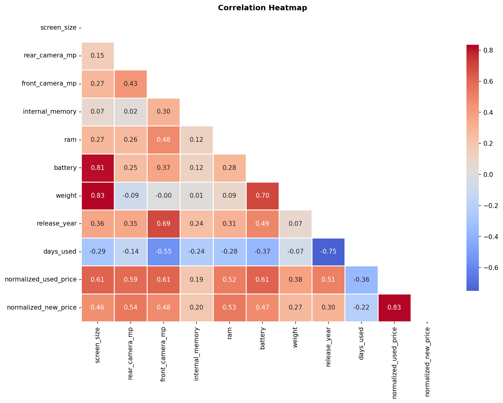
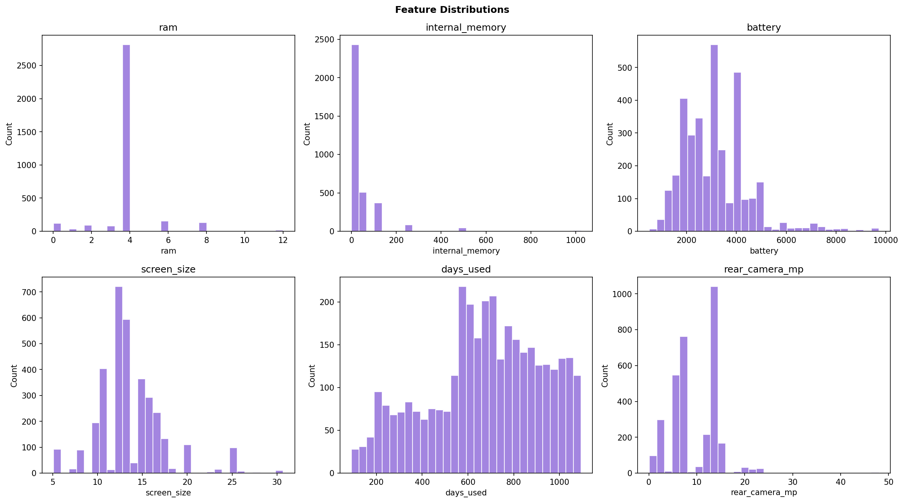

# Linear Regression Model

## Mission and problem

My mission is to use technology as a tool for inclusion and empowerment in Africa.  
This project predicts normalized used handheld device prices from device and usage features.  
**Dataset:** [Used Handheld Device Data (Kaggle)](https://www.kaggle.com/datasets/ahsan81/used-handheld-device-data).  
The use case is specific (second-hand device pricing), **not** generic, and **not** the house-prediction example from class.

### Visualizations (README)





## Deployed API

The inference service is hosted on Render. Interactive documentation and testing are available at the following endpoints (HTTPS, publicly routable):

- **Base URL:** [https://linear-regression-model-0nn0.onrender.com](https://linear-regression-model-0nn0.onrender.com)
- **OpenAPI / Swagger UI:** [https://linear-regression-model-0nn0.onrender.com/docs](https://linear-regression-model-0nn0.onrender.com/docs)
- **Endpoints:** `GET /health`, `GET /metrics`, `POST /predict`
- **Retraining:** `POST /retrain` accepts a CSV upload (multipart form); query parameter `mode` may be `replace` (default) or `append`. When the environment variable `RETRAIN_API_KEY` is set, requests must include header `X-Retrain-Key` with the same value.

Cross-origin access is restricted via explicit origin lists in `CORS_ORIGINS` (configured in [`render.yaml`](render.yaml)); wildcard origins are not used.

## Video demonstration

* [Video demonstration on YouTube](https://youtu.be/W9CKvBbY34g).

## Repository layout

| Path | Contents |
|------|----------|
| `summative/linear_regression/` | `multivariate.ipynb`, `used_device_data.csv`, `training_pipeline.py`, `export_model_metadata.py`, `output/` |
| `summative/API/` | `main.py`, `prediction.py`, `preprocess.py`, `requirements.txt` |
| `summative/FlutterApp/` | Flutter client |

## Modeling and training

Exploratory analysis, preprocessing, and model comparison are documented in [`summative/linear_regression/multivariate.ipynb`](summative/linear_regression/multivariate.ipynb). I fit ordinary least-squares linear regression, a decision tree, and a random forest; I also recorded train and test error across epochs using stochastic gradient descent for the linear formulation. The artifact with the lowest test mean squared error is persisted as `summative/linear_regression/output/best_model.pkl`, with companion metadata and metrics in the same directory.

To reproduce the trained artifacts after changing the CSV or code:

```bash
cd summative/linear_regression && python3 training_pipeline.py
```

The script `export_model_metadata.py` invokes the same training routine.

## API service

The FastAPI application is defined under `summative/API/`. Model files are read from `summative/linear_regression/output/` by default (overridable with `MODEL_DIR`); the default serialized estimator is `best_model.pkl` (`MODEL_FILE`). Dependencies are pinned in `requirements.txt` (scikit-learn 1.6.x for compatibility with the saved pickles). Deployment is described in [`render.yaml`](render.yaml).

## Flutter client

The mobile client calls the deployed base URL above and posts to `/predict`. To build and run:

```bash
cd summative/FlutterApp && flutter pub get && flutter run
```

An alternate base URL may be supplied at build time with `--dart-define=API_BASE_URL=...` if the deployment endpoint changes.
